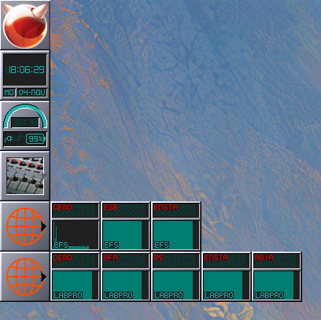

# PyWMMando

To be used with Mando monitor.

Highly private project to give a dockapp that continuously gives response time for each service.

### Mentions

This software is based on efforts made by [@gryf on wmdocklib](https://github.com/gryf/wmdocklib) and [pywmtemp](https://github.com/gryf/pywmtemp).

## Example

```bash
./pywmmando.py --name demo --service efs --endpoint https://fake.com/json/states/efs-demo
```

[]
